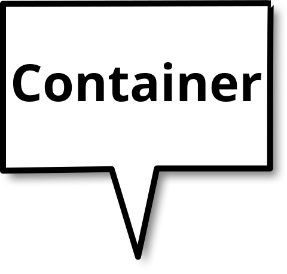

class: middle, center, backgroundblue
layout: true
count: false

.footnote[]

---
background-image: url(images/container-lock.png)

.lower[
# Secret management in containers
]

.citation[
Source: https://californiashippingcontainers.wordpress.com/2013/04/28/california-storage-and-shipping-security/
]

???

- Thank you for having me today!
- I'm going to be talking about containers and secrets, how you deal with secrets in containers, about security in general and how Hashicorp's Vault might, and should, help you spin your security thread a little tighter than before

---
class: center

.image[

]

???

- This is my actual business card, I have them with me
- I call myself a "birth assistant", a birth assistant
  - If you didn't know, it is the male equivalent to a midwife
- And I call myself a birth assistant because that's why I usually do .. every larger (and sometimes smaller) software and/or hardware projects is precious to product managers, developers and engineers alike, and I help people bring their software and hardware babies into the world, using DevOps, Continuous Delivery, Microservices and some other buzzwords I forgot about right now

- But let's get to why we're here

---

.speech-bubble[
# Running apps with secrets 
]

???

- You're probably sitting here listening to me babbling because you either are curious about running applications in containers, or are already running apps in containers, and you want to find out how you would be able to supply secrets to those apps in a secure fashion
- Secrets are necessary usually, because they establish identity, which in turn is needed for authentication, and later-on authorization
- Without them identity management becomes a hard and complicated problem, that's why secrets are used to widely to represent identity
- Most people tend to misuse secrets also for authentication, or even authorization (very long lived tokens)

- The usual practice with containers these days is, secrets are attached to a container using environment variables, and it should be pretty obvious as to why this is a bad idea, right?

---

.left[

# Access inside the container

```sh
$ docker exec -ti my-app-container env
MYSQL_PASSWORD="ohnoes"
```
]

???

- If you're using environment variables, anything and everything has access to them inside your containers environment

--

.ohno[

]

???

- That can be your app, but could also be a malicious attacker, you wouldn't know
- Once you're inside the container environment, everything is lost, even when you've considered best practices and your app isn't running as root (which you should absolutely avoid!)

- But you don't even have to go that far

---

.left[

# Access outside the container

```sh
$ docker inspect my-app-container | grep MYSQL_PASSWORD
    MYSQL_PASSWORD="ohnoes"
```

]

???

- Most people tend to disregard the dangers lurking from within; "inside attackers"
- You can read any and all information attached to a container from the outside, using the inspect syntax for Docker
- That's a pretty big risk, especially if you're trying to practice DevOps

---
layout: true
class: left, top

---
class: backgroundblue

# Disadvantages

.footnote[]

.citation[
Source: http://giphy.com/gifs/sad-panda-7p3e2WCM0VEnm
]

???

- To sum it up

--

## Secret exposed in environment

???

- Secrets in environment variables are a no-go, since they are exposed to pretty much anyone who can read from that particular environment (which is a potentially large audience)

--

## Inside access = exposure

???

- If you get into the container somehow, your secrets are toast, since all the attacker has to do is run `env`

--

## Outside access = exposure

???

- If you're on the host with access to the Docker daemon your secrets are exposed as well

--

.panda-bad-time[

]

???

- All in all we are talking about some major headaches when it comes to using/abusing secrets this way

- So what would be a viable alternative?

---
layout: true
class: middle, center

.footnote[]

---
class: backgroundgreen

# Hashicorp Vault

.logo[]

.citation[
Source: https://vaultproject.io
]

???

- I'm going to be talking about Hashicorp's Vault for manging secrets in containers today
- There are other solutions, like KeyWhiz, but I'm going to be focussing on Vault
  - Hashicorp has a whole section in the Vault docs devoted to a comparison of Vault vs. other solutions, and I encourage you to read it if you think your preferred solution right now is a better fit

- So what is Vault?

---
layout: true
class: middle, left. backgroundblue

.footnote[]
---

# Project statement

.quote[
Vault secures, stores, and tightly controls access to tokens, passwords, certificates, API keys, and other secrets in modern computing.
]

.citation[
Source: http://www.vaultproject.io
]

???

- Here's there project statement
- It basically states that Vault can be your one-stop-shop for anything secret "in modern computing" (whatever that is)

---
layout: true
class: top, backgroundblue

.footnote[]
---

# Features

--

## (Dynamic) Secret Storage

???

- For starters, everything in Vault is encrypted by default
  - Transit, information at rest, even its own configuration
- You can then get a token, which you provide credentials for
  - Using a username/password or other means
- This token lets you run certain actions (like fetching secrets at a particular location)
- The tokens are short-lived, but can be "renewed"

--

## Key Rolling for third party services

???

- You can also dish out secrets for services that are "foreign" to Vault, including automatic "key rolling", the refreshing of said secrets, for e.g. databases or ssh
  - More on that later

--

## Audit trail

???

- Everything is tracked/monitored; you get a trail of actions, no actions involving secrets are untracked anymore
  - This means every user is accountable, and user actions can be traced

--

## Integrates with other auth services

???

- And last but not least, you can use credentials for Vault that you already have established, like GitHub or LDAP
  - More on that later as well

- All around Vault is a viable solution for the problem of keeping secrets in distributed environments, because not only is it good at keeping them, but it's also good at establishing trust (through authentication providers) and keeping that trust alive (through auditing)

---
layout: true
class: middle, backgroundblue

.footnote[]
---
class: center
background-image: url(images/vault.png)

# Options for running Vault

.citation[
&copy; Grant Carmichel
]

???

- There are a lot of options for running Vault, popular choices include S3 as a backend, or Zookeeper, etcd .. or Hashicorp's own service discovery solution, Consul

---
class: center

.logos[
<figure>
  
  <figcaption>Consul</figcaption>
</figure>
<h1>+</h1>
<figure>
  
  <figcaption>Vault</figcaption>
</figure>
]

???

- I usually recommend Consul, because not only is it possible to run a Vault cluster with Consul as its highly available backend, Consul is also stupidly easy to run, maintain and scale
- If you've ever gone through the pain of upgrading a Zookeeper cluster you know what I'm talking about

---

# Prerequisites

## Consul as persistence HA backend
## Vault in a 2+n cluster setup

???

- So my standard setup is Consul, as 3+ node cluster, since it is very resilient
  - I wouldn't use S3, since it doesn't support Vault's cluster mode
  - And I've heard the people on the east coast wouldn't recommend S3 either right now

- Additionally to that you should be running Vault in a 2+n node cluster setup, just to avoid service downtimes
- It's as easy to setup up as Consul's cluster mode
  - It's not a "true" cluster in a way, since non-master nodes are just redirecting traffic to one master node
  - They can be told to serve traffic as well though, which makes them good for "just" reading secrets

- Vault makes use of Consul's service check capabilities, not only to provide you with healthchecks, but also to register itself in Consul's DNS backend
  - i.e. you will be able to refer to Vault's master through the DNS address "active.vault.service.consul", which is neat
  - Consul is used for service discovery after all

- Lastly, all data is encrypted by default, Vault never stores plaintext in any of its backends

- It's very convenient, if Vault dies you'll only need to unlock once it comes back up, all the data is still there, and secure

---

# Sample containerized app

???

- Let's take a look at what running Vault and using it for secret management with containers actually looks like!
- You will get access to all of the source code, including configuration, Dockerfile, scripts to run the solution, and some documentation, later. I'll tweet out a link, but you can also find me on GitHub; it will be there, I promise :)

---

### Dockerfile

[embedmd]:# (Dockerfile dockerfile /FROM/ /2015/)

???

- I've written a small Dockerfile, whose only purpose is to serve a simple website (`index.html`)
- As you can see, I'm using `caddy` for that, a very neat and simple web server, written in Golang
- I'm also installing/using a tool called `consul-template`, and you guessed it, this is where the magic happens, and we'll come to that in a second

---

### index.html template

[embedmd]:# (docker/index.html.ctmpl html)

???

- This is the "template", which we'll be using for our index.html
- It's as barebones as it can be, but is has one dynamic component in it: It can read a dynamic secret from Vault
- But we need another application to build that template

---

.decap[
# consul-template
]

https://github.com/hashicorp/consul-template

???

- And its name is consul-template
- The name is a little confusing, since it was originally written to only get values out of Consul KV store, but Hashicorp added the ability to read (and write!) Vault secrets from/to it
- It's a mixture between a poor-man's process supervisor, a templating engine, and a dynamic Vault client

- It is what you can use to populate configuration files, templates and other confidential files with secrets that are stored in Vault

---

## Dockerfile again

[embedmd]:# (Dockerfile dockerfile /CMD/ /\]/)

???

- I purposefully omitted the last line from the Dockerfile before
- This shows that we aren't actually starting caddy, the webserver I mentioned before, when the container is run, but rather we are starting consul-template instead using a configuration we also added to the container

---
layout: true
class: top, backgroundblue

.footnote[]

---

## consul-template example configuration

[embedmd]:# (docker/consul-template.conf hcl)

Docs at https://github.com/hashicorp/consul-template

???

- The first paragraph tells consul-template where to find Vault, what token it should use (Which can also be supplied through different means), and whether or not it should use TLS to connect to Vault
  - Notice how the section contains the keyword "**renewable**"; this essentially means the token consul-template is using only has a certain lifetime associated with it, and that it will expire sooner or later
    - By telling consul-template about this you enable it to automatically refresh it's own token's lifetime; so even when an attacker gains access to the original token after consul-template has died it will be of no use since it will already have expired
- The second paragraph introduces the `exec` stanza, which is capable of running (and to a certain extend also supervising) a single process
  - This process will get run once all templates have been rendered successfully at least **once**
  - Afterwards, and if secrets are changing, consul-template will re-render all its templates, and then stop and restart the command specific in its `exec` directive
    - You can also specify whether consul-template should send a specific signal to the already running process (i.e. for it to reload its configuration), or whether it shouldn't bother with the underlying process at all

- The last paragraph specifies a template
  - You can have any number of templates rendered through consul-template, just keep in mind that it doesn't run your `exec` paragraph unless it has successfully rendered all templates at least once
  - You can render templates either with or without secrets or values provided either by Vault or Consul, or with environment variables you provided yourself
- consul-template comes with its own template language, which is intuitive, well-documented and easy to pick-up; read it up in the docs on their website

---

## Building it all

???

- I've written a script to conveniently build and run a new image whenever I need it

--

[embedmd]:# (go bash /function task_build/ /\}/)

???

- This part is pretty obvious

--

[embedmd]:# (docker-compose.yml yaml)

???

- I'm using docker-compose to connect both, the app and an instance of the official Docker image for Vault, supplied by Docker Inc. itself
- Now when you would just run `docker-compose up` this wouldn't work since consul-template would be looking for secrets in Vault that don't exist yet, and it would also be using a token that's not yet provisioned (as I explained earlier)
- For the purposes of this presentation we are going to be running Vault in "dev" mode though, where Vault starts up "unsealed" (i.e. you don't have to unlock it using your root password) and with a root-token specified on the command line

---

## Initializing Vault

[embedmd]:# (go bash /export/ /18200"/)

???

- To initialize Vault step-by-step first I need to tell the client I'm going to use where to find Vault and what root-token to use
- Usually you don't get to specify your own root-token, but rather Vault generates a secure (and complicated) key combination for you

--

[embedmd]:# (go bash /function task_run/ /\}/)

???

- I also need a little startup routine for initializing Vault; luckily, docker-compose makes this easy for me

1. I start up Vault only
2. I create a new, renewable token with it
3. I put a secret into Vault that's later used to render the index.html template
  - It's important to note that I set the `ttl` of this secret to `1m`, meaning consul-template will revisit and refresh the content of this particular secret every 30 seconds (lifetime / 2 by default); this makes it possible to change secrets dynamically and on the fly; and quite possibly without having to restart your application even!
4. I can then run the actual container and supply the token I created earlier

- At least, I start the actual app container, which then runs consul-template, which in turn renders the index.html template and then starts the webserver

- The bit at the top just makes sure I'm leaving to no trace after having provisioned this environment

---
layout: true
class: middle, center, backgroundblue

.footnote[]
---

# Live demo

???

- So, let's take a look at the actual application right now!
- **SWITCH**

1. Show Dockerfile
2. Show go script
3. Run build (force)
4. Start Vault/app
5. Visit website
6. Change secret
7. Observe restart
8. Refresh website
9. ...
10. Profit!
11. **SWITCH**

- This is all what you get "for free" when using Vault and consul-template
- And if you're saying "Bah, I don't have templates, just environment variables, I need them", well

---

.left[
.decap[
# envconsul
]

https://github.com/hashicorp/envconsul

## Available for 12-factor applications
]

???

- Then use consul-template's cousin, envconsul!
- It does exactly what consul-template does, but exposes secrets in environment variables **only the app started by envconsul has access to**
- Simply running `env` will no longer be enough; you will have to inspect the apps memory space, debug its heap etc.

--

.left[

```sh
$ envconsul -config envconsul.conf -secret "/secret/my_app" env
secret_my_app_secret=very_secret
```
]

---
layout: true
class: middle, left, backgroundblue

.footnote[]
---

## Dynamic secrets
## Zero exposure to environment
## No secrets persisted anywhere but in Vault
## You know who did what and when

???

- Truly dynamic secrets; you can change them at any time with minimal impact on your running apps
- It can all be done with zero exposure to the environment the app is running in
- No secrets have to live anywhere but in Vault
- All of it can be fully audited and tracked (I haven't shown that today, but there is only so much time)

- Obviously, if you are developing applications today, why bother with second hand "runners" and application supervisors .. Why not start using Vault directly?

---

# Native integration
## SDKs for popular languages
## Easy to use and well documented REST API

???

- There are native SDKs for all popular languages which enable to use Vault directly
- On top of that, its REST API is very straightforward and easy to use, as well as exceptionally well documented
- Hashicorp is also very responsive when it comes to extending their product's capabilities, according to customer need

--

```sh
curl -H "X-Vault-Token:renewable" -X GET http://127.0.0.1:18200/v1/secret/some/secret
```

???

- This is an example for using the REST API, this is how easy it is to use Vault from the command line
- How great is that?!

- (Obviously, there is always a Golang command line interface (which is also the Vault server, go figure!))

---
layout: true
class: center, middle

.footnote[]
---
background-image: url(images/apple-wallpaper.jpg)
class: center

.lower[
.decap[
# One more thing ...
]
]

.citation[
&copy; Apple Inc.
]

???

- I mentioned earlier that there are a lot of third party services Vault can interact with, either for providing credentials for authenticate users or services, or as a credential provider itself, as a secret backend
- Here are some of the examples!

---
layout: true
class: left, middle, backgroundblue

.footnote[]
---

## Different auth backends
### GitHub, RADIUS, EC2 ...
## Different secret backends
### PKI, MySQL, Cassandra, SSH ...
## Different audit backends
### File, Syslog, socket

.app-logos[


]

???

- You can use popular services such as GitHub for user authentication, including groups and organization level support
- You can also use established identity providers such as RADIUS or LDAP
- And if you're running on AWS, Vault can use each instance's IAM profile to securely authenticateapps running on them and provide secrets without having to use a side channel

- Have you ever set up a full fledged PKI? It's a freaking pain in the ass. Well, Vault can do this for you, with all the bells and whistles you need!
  - root-cert management, intermediate-certs, fully-managed root or provided root, client or servers certs, OSP, OSCP, certificate expiration/revocation .. it's all in there

- One of the most interesting features for me is though that Vault is able to hook into existing software solutions and act as an authenticate and authorization provider for those solutions;
  - I have mentioned MySQL, Cassandra and SSH here
  - You basically have users or services get their database credentials from Vault instead of the database
  - They are dynamic, they expire, everything access is audited

- And finally, as I just mentioned, Vault is capable of submitting its internal auditing log to numerous aggregation instances, be it a flat file, writing it into syslog, or sending it to a local or remote socket; it's all possible

---
layout: true
class: center, middle

.footnote[]
---
background-image: url(images/container-lock.png)

.dark-bg[
# Thanks!
<i class="fa fa-twitter"></i> @moritzheiber | <i class="fa fa-envelope"></i> mheiber@thoughtworks.com | <i class="fa fa-home"></i> heiber.im
]
